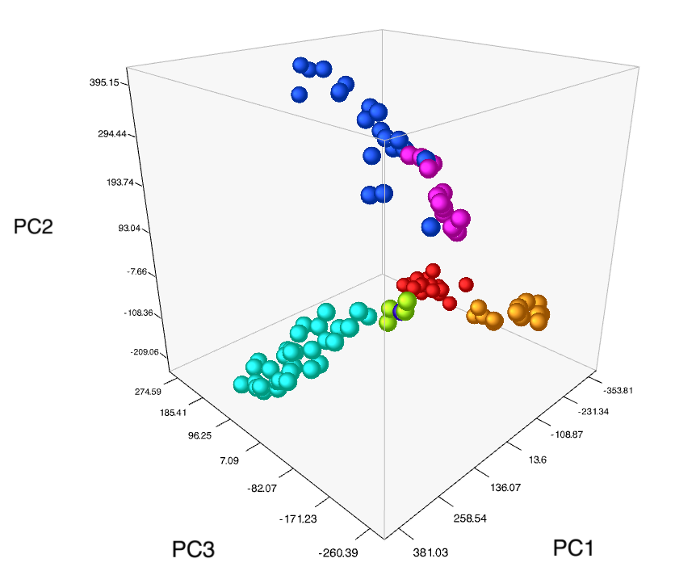

# Principal Component Analysis
This project uses Principal Component Analysis (PCA) to help visaulize a large data set. Additionally, PCA is commonly used to speed up the fitting of a machine learning alogrithmn. PCA is an unsupervised learning method that patterns present in high-demensional data to reduce the complexity of the data while retaining information.

## Project Intro/Objective

I used Principal Component Analysis (PCA) to explore the purchasing habits of customers at the Dram Shop. To better understand the patterns of consumption in the shop, which has a large number of items, I implemented dimensionality reduction techniques. I completed this assignment using a Jupyter notebook.

This project uses Python and the following libraries :

* pandas

* numPy

* matplotlib

* scikit-learn 

* Google BigQuery 

 
 

## Key learnings
1. Principal Component Analysis (PCA) can be used to explore purchasing habits of customers.
2. Dimensionality reduction techniques can be implemented to better understand patterns of consumption.
3. PCA can be used to identify customer segments based on their purchasing habits.
4. Visualizing data with PCA can help uncover trends and patterns in customer purchases. 